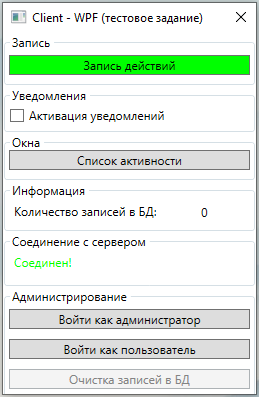
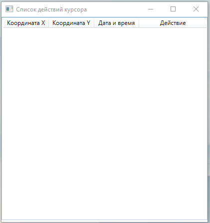

✨Проект: Cursor Finder
🧵Платформа: WCF + WPF (.Net)

### 🎛 Тестовые данные:

```
TestmailReceive@transkart.ru
&gFTPt1%

TestmailSend@transkart.ru
X%Yr8owH
```


### 🎛 Структура:

⚙ **Client-WPF** - Клиентское приложение.

**⚙ Host-WCF** - Хостинг для WCF службы.

⚙ **Server-WCF** - Логика WCF приложения.


### 🎞 Главное окно:



### 🎞 Окно просмотра событий:

